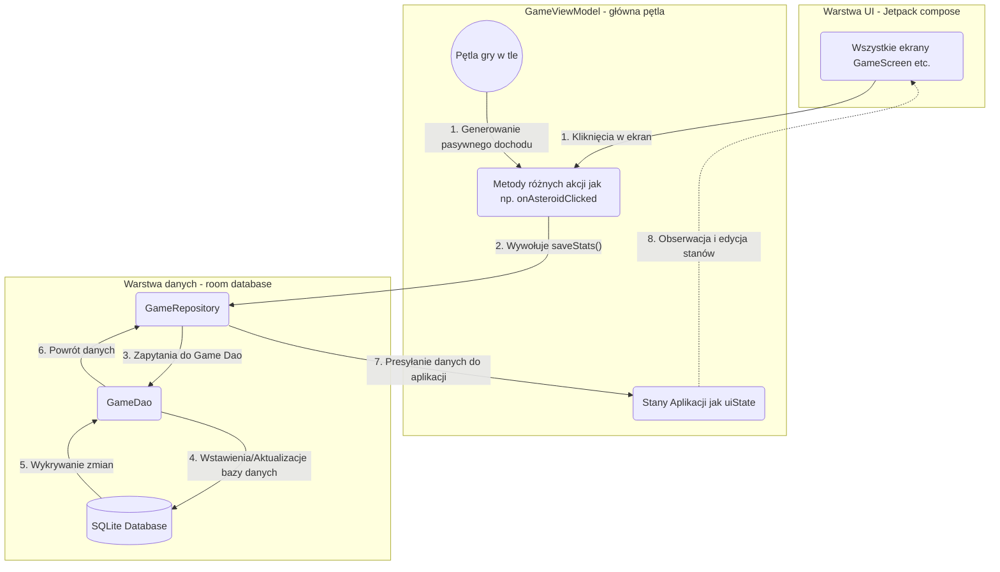

# Asteroid Clicker

### ⚠️ Projekt uniwersytecki - używaj na własne ryzyko!

Asteroid Clicker to gra mobilna na system Android, w której gracz klika w asteroidę, aby zdobywać zasoby, kupować ulepszenia i odblokowywać osiągnięcia. Projekt został zrealizowany przy użyciu nowoczesnych narzędzi i rekomendowanej architektury dla platformy Android.

## 🚀 Funkcjonalności
- **Gra:** Interaktywna asteroida z animacjami, system automatycznego wydobycia (auto-mining) oraz ulepszania mocy kliknięcia.
- **Profil gracza:** Śledzenie statystyk (łączna gotówka, kliknięcia, wykupione ulepszenia, odblokowane osiągnięcia).
- **Ustawienia aplikacji:** Konfiguracja dźwięku i wibracji, wsparcie wielojęzyczności (Polski / Angielski) oraz opcja całkowitego resetu postępów.
- **Menu i Nawigacja:** Ekran powitalny prowadzący do panelu Gry, Profilu, Osiągnięć oraz panelu Kredytów.

## 🛠 Technologie i Architektura
- **Język:** Kotlin
- **UI:** Jetpack Compose (w tym Material Design 3 oraz system animacji).
- **Nawigacja:** Navigation Compose.
- **Baza danych:** Room Database (z użyciem Kotlin Flow do reaktywnego odświeżania UI).
- **Architektura:** MVVM (Model-View-ViewModel) z wykorzystaniem Coroutines.

---

## 🗺 Makiety przejść (Navigation Flow)
Poniżej znajduje się wizualizacja ścieżek nawigacji użytkownika w aplikacji (np. Menu Główne $\rightarrow$ Gra, Profil). 

---

## 🗄 Schemat bazy danych
Aplikacja przechowuje stan gry lokalnie z wykorzystaniem biblioteki **Room**. Baza danych składa się z trzech głównych encji:
1. **`user_stats`** - Globalne statystyki gracza (np. `currentCash`, `clickPower`, `passiveIncomePerSecond`) oraz jego preferencje (`isSoundEnabled`, `selectedLanguage`).
2. **`upgrades`** - Informacje o posiadanych ulepszeniach i ich poziomach.
3. **`achievements`** - Rejestr postępów osiągnięć gracza.
4. **`atlas_unlocked`** - Rejestr odblokowanych planet w atlasie

## 🔄 Repozytorium
Aplikacja kożysta z repozytorium w celu komunikacji między bazą danych `GameRepository`
- Zwraca dane w formie strumieni `(Flow<T>)`, dzięki czemu każdy nowy zakup, zmiana gotówki czy odblokowana planeta automatycznie i natychmiastowo aktualizuje interfejs użytkownika.
- Zawiera asynchroniczne funkcje (np. `saveStats`, `unlockPlanet`) do bezpiecznego zapisywania postępów w tle, by nie zaciąć ekranu gry.

## 🧠 ViewModel

Aplikacja posiada 2 główne ViewModele:
1. `GameViewModel` (Główny silnik gry):
    - **Zarzadzanie stanem**: Śledzi który gracz jest zalogowany i pobiera jego dane oraz jest odpowiedzialny za zmianę gracza `switchUser`.
    - **Pętla Gry**: Posiada działającą w tle pętlę asynchroniczną która co sekunde dodaje graczowi pasywny dochód pod warunkiem że gracz wykupił odpowiednie ulepszenie.
    - **Obsługa Akcji**: Zmiany wywołane kliknięciami, takie jak kliknięcie w asteroidę `onAsteroidClicked` kupowanie planet `buyPlanet` są przeliczane w modelu i wysyłane do bazy poprzez repozytorium
2. `MainMenuViewModel`:
    - Odpowiada za logikę wyłącznie Menu Głównego. Zmienia kliknięca przycisków w jednorazowe zdarzenia.

## 🔄 Przepływ danych

---

## ⚙️ Uruchomienie projektu
1. Sklonuj repozytorium na swój dysk lokalny.
2. Otwórz projekt w środowisku **Android Studio**.
3. Upewnij się, że synchronizacja Gradle (Gradle Sync) zakończyła się pomyślnie.
4. Zbuduj i uruchom aplikację na emulatorze lub podłączonym urządzeniu fizycznym z systemem Android (Minimalne API: 24, Docelowe API: 36).
