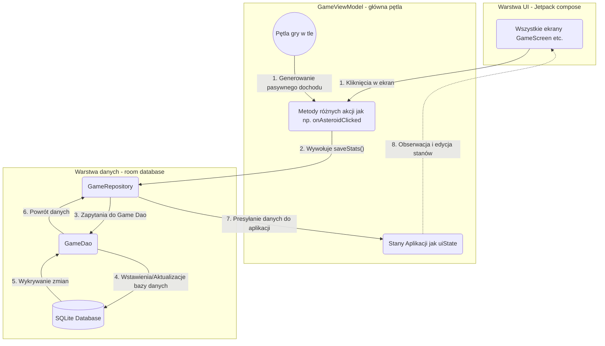

# Asteroid Clicker

### ⚠️ Projekt uniwersytecki - używaj na własne ryzyko!

Asteroid Clicker to gra mobilna na system Android, w której gracz klika w asteroidę, aby zdobywać zasoby, kupować ulepszenia i odblokowywać osiągnięcia. Projekt został zrealizowany przy użyciu nowoczesnych narzędzi i rekomendowanej architektury dla platformy Android.

## 🚀 Funkcjonalności
- **Gra:** Interaktywna asteroida z animacjami, system automatycznego wydobycia (auto-mining) oraz ulepszania mocy kliknięcia.
- **Profil gracza:** Śledzenie statystyk (łączna gotówka, kliknięcia, wykupione ulepszenia, odblokowane osiągnięcia).
- **Ustawienia aplikacji:** Konfiguracja dźwięku i wibracji, wsparcie wielojęzyczności (Polski / Angielski) oraz opcja całkowitego resetu postępów.
- **Menu i Nawigacja:** Ekran powitalny prowadzący do panelu Gry, Profilu, Osiągnięć oraz panelu Kredytów.

## 🛠 Technologie i Architektura
- **Język:** Kotlin
- **UI:** Jetpack Compose (w tym Material Design 3 oraz system animacji).
- **Nawigacja:** Navigation Compose.
- **Baza danych:** Room Database (z użyciem Kotlin Flow do reaktywnego odświeżania UI).
- **Architektura:** MVVM (Model-View-ViewModel) z wykorzystaniem Coroutines.

---

## 🗺 Makiety przejść (Navigation Flow)
Poniżej znajduje się wizualizacja ścieżek nawigacji użytkownika w aplikacji (np. Menu Główne $\rightarrow$ Gra, Profil). 

---

## 🗄 Schemat bazy danych
Aplikacja przechowuje stan gry lokalnie z wykorzystaniem biblioteki **Room**. Baza danych składa się z trzech głównych encji:
1. **`user_stats`** - Globalne statystyki gracza (np. `currentCash`, `clickPower`, `passiveIncomePerSecond`) oraz jego preferencje (`isSoundEnabled`, `selectedLanguage`).
2. **`upgrades`** - Informacje o posiadanych ulepszeniach i ich poziomach.
3. **`achievements`** - Rejestr postępów osiągnięć gracza.
4. **`atlas_unlocked`** - Rejestr odblokowanych planet w atlasie

## 🔄 Repozytorium
Aplikacja kożysta z repozytorium w celu komunikacji między bazą danych `GameRepository`
- Zwraca dane w formie strumieni `(Flow<T>)`, dzięki czemu każdy nowy zakup, zmiana gotówki czy odblokowana planeta automatycznie i natychmiastowo aktualizuje interfejs użytkownika.
- Zawiera asynchroniczne funkcje (np. `saveStats`, `unlockPlanet`) do bezpiecznego zapisywania postępów w tle, by nie zaciąć ekranu gry.

## 🧠 ViewModels

### 🛠 GameViewModel

`GameViewModel` to główny silnik logiki gry, zarządzający stanem gracza, pętlą rozgrywki, systemem zakupów oraz mechaniką postępów w tle (offline). Poniżej znajduje się zestawienie wszystkich dostępnych funkcji i udostępnianych strumieni danych.

#### 📊 Strumienie Stanu (StateFlows)
Poniższe zmienne są bezpośrednio obserwowane przez UI (np. przy użyciu `collectAsState()`) i automatycznie odświeżają widoki przy każdej zmianie w bazie:

* **`uiState: StateFlow<UserStatsEntity>`** – Zwraca aktualne statystyki zalogowanego gracza, w tym ilość gotówki, siłę pojedynczego kliknięcia, pasywny dochód na sekundę oraz stan ustawień użytkownika.
* **`ownedUpgrades: StateFlow<List<UpgradeEntity>>`** – Zwraca listę wszystkich ulepszeń wykupionych przez obecnego gracza, zawierającą ich identyfikatory i aktualne poziomy.
* **`unlockedPlanets: StateFlow<Set<Int>>`** – Zwraca unikalny zbiór (`Set`) identyfikatorów (`ID`) planet, które zostały już odblokowane w Atlasie.

#### 🎮 Akcje Gracza (Publiczne Metody)
Funkcje wywoływane przez interfejs użytkownika w odpowiedzi na kliknięcia i interakcje:

* **`switchUser(newUsername: String)`**
    Zmienia aktywny profil gracza w grze. Wywołanie tej funkcji wymusza automatyczne przebudowanie strumieni `uiState`, `ownedUpgrades` i `unlockedPlanets` pod kątem danych dla nowej nazwy użytkownika.

* **`onAsteroidClicked()`**
    Główna interakcja z grą. Dodaje gotówkę do konta na podstawie posiadanej statystyki `clickPower`, zwiększa licznik całkowitych kliknięć i wymusza nadpisanie aktualnego czasu `lastSavedTimestamp`. Na końcu uruchamia również weryfikację ewentualnych osiągnięć.

* **`buyUpgrade(upgrade: Upgrade)`**
    Przetwarza proces zakupowy wybranego ulepszenia. Oblicza wymagany koszt na podstawie wbudowanego wzoru potęgowania (`costMultiplier.pow(currentLevel)`), a w przypadku wystarczającej ilości gotówki zapisuje nowy poziom upgade'u i na nowo przelicza ogólną moc uderzeń oraz dochód pasywny.

* **`buyPlanet(planetId: Int, cost: Long)`**
    Odpowiada za zakup obiektów w sekcji Atlasu. Weryfikuje dostępne saldo gotówkowe, a następnie potrąca koszt i zapisuje identyfikator planety w repozytorium jako odblokowany dla konkretnego profilu.

* **`checkAndSaveAchievements(statsToUse: UserStatsEntity? = null)`**
    Przechodzi przez listę wszystkich zdefiniowanych w grze osiągnięć i sprawdza, czy przekroczono wymagane wartości progowe. Aktualizuje bazę o nowe, pomyślnie odblokowane statusy osiągnięć.

* **`clearAllData()`**
    Reset profilu użytkownika. Usuwa całkowicie z bazy Room encje powiązane z nazwą obecnie wybranego gracza, po czym nadpisuje go nowym, wyzerowanym rekordem inicjacyjnym z aktualnym znacznikiem czasowym.

#### ⚙️ Metody Ustawień
Poniższe metody pobierają wprost wartość zmienioną z UI i natychmiast asynchronicznie zapisują ją do encji stanu gracza wewnątrz bazy danych:
* **`updateSoundSettings(enabled: Boolean)`** – Zmienia preferencje odtwarzania efektów dźwiękowych.
* **`updateVibrationSettings(enabled: Boolean)`** – Zmienia preferencje dotyczące wibracji haptycznych.
* **`updateLanguage(langCode: String)`** – Zapisuje zmieniony kod wybranego języka w interfejsie.

#### 🔒 Logika Wewnętrzna (Metody Prywatne)
Funkcje asynchroniczne odpalane wprost przez sam ViewModel, wykorzystywane jako silnik operacji na bocznych wątkach (coroutines):

* **`processOfflineEarnings(username: String)`** *(prywatna)*
    Odpowiada za system zarobków podczas nieobecności gracza. Uruchamiana samoistnie po wykryciu zmiany gracza (lub przy włączeniu aplikacji) sprawdza czas w ms ujęty w `lastSavedTimestamp` i konwertuje różnicę na sekundową wartość. Mnoży ten czas przez zyski pasywne, po czym hurtowo dopisuje nagrodę do licznika gracza.

* **`recalculateAndSaveStats(costToDeduct: Long = 0)`** *(prywatna)*
    Wywoływana automatycznie po pomyślnym przebiegu funkcji `buyUpgrade`. Przelicza na nowo wszystkie matematyczne parametry od ulepszeń kliknięć i ulepszeń zysków pasywnych, pomniejszając przy tym całkowitą gotówkę o koszt i zapisując postępy za jednym zamachem w repozytorium.

### 🧭 MainMenuViewModel

`MainMenuViewModel` to lekki model odpowiadający za separację logiki interfejsu Menu Głównego od systemu nawigacji w aplikacji (tzw. routera). Jego głównym zadaniem jest bezstanowa zamiana intencji użytkownika (kliknięć) na jednorazowe, asynchroniczne zdarzenia (events).

#### 🌊 Strumienie Zdarzeń (SharedFlow)

* **`menuEvents: SharedFlow<MainMenuEvent>`** – Główny, publicznie dostępny strumień w tym modelu. Nasłuchuje on i "wypycha" obiekty należące do zapieczętowanej klasy `MainMenuEvent` do interfejsu użytkownika (UI), który po ich odebraniu podejmuje decyzję o właściwym przejściu na nowy ekran.

#### 🖱️ Akcje Interfejsu (Publiczne Metody)

Wszystkie poniższe metody pełnią rolę tzw. *triggerów* – są podpinane do atrybutów `onClick` przycisków w głównym menu. Każda z nich korzysta z `viewModelScope.launch`, aby bezpiecznie i asynchronicznie wyemitować odpowiadające jej zdarzenie:

* **`onPlayClicked()`** Emituje zdarzenie `MainMenuEvent.NavigateToGame`, informujące system nawigacji o chęci przeniesienia gracza do głównego ekranu rozgrywki.

* **`onProfileClicked()`** Emituje zdarzenie `MainMenuEvent.NavigateToProfile`, wywołując przejście do ekranu zarządzania obecnym profilem.

* **`onAchievementsClicked()`** Emituje zdarzenie `MainMenuEvent.NavigateToAchievements`, przenosząc użytkownika do widoku podglądu odblokowanych i zablokowanych osiągnięć.

* **`onCreditsClicked()`** Emituje zdarzenie `MainMenuEvent.NavigateToCredits`, ładując ekran z informacjami o twórcach aplikacji i podziękowaniami.

* **`onAtlasClicked()`** Emituje zdarzenie `MainMenuEvent.NavigateToAtlas`, kierując gracza do zaimplementowanej sekcji Atlasu, w której może przeglądać i odblokowywać kolejne planety/gwizady.

## 🔄 Game Repository

`GameRepository` pełni rolę jedynego źródła prawdy (Single Source of Truth) pomiędzy logiką aplikacji (ViewModelami) a bazą danych Room (za pośrednictwem `GameDao`). Repozytorium dba o to, aby wszystkie operacje odczytu i zapisu w grze były rygorystycznie przypisane do konkretnego gracza (poprzez argument `username`), co umożliwia bezpieczne zarządzanie wieloma profilami.

### 👤 Statystyki Gracza (User Stats)
* **`getUserStats(username: String = "Player1"): Flow<UserStatsEntity?>`**
  Zwraca ciągły strumień danych (`Flow`) z aktualnymi statystykami gracza. Dzięki temu interfejs automatycznie odświeża się po każdej zmianie stanu gotówki czy mocy kliknięcia.
* **`saveStats(stats: UserStatsEntity)`**
  Asynchroniczna funkcja (`suspend`) zapisująca lub nadpisująca (upsert) obiekt statystyk w bazie danych, wykorzystywana m.in. w pętli gry i przy kliknięciach.
* **`deleteUser(username: String)`**
  Asynchroniczna funkcja trwale usuwająca rekord statystyk użytkownika o podanej nazwie z bazy. Używana przy całkowitym resecie postępów.

### 🚀 Ulepszenia (Upgrades)
* **`getAllUpgrades(username: String = "Player1"): Flow<List<UpgradeEntity>>`**
  Zwraca strumień (`Flow`) zawierający listę wszystkich ulepszeń wykupionych przez użytkownika, na bieżąco odświeżający ekrany sklepów.
* **`getAllUpgradesDirect(username: String = "Player1"): List<UpgradeEntity>`**
  Asynchroniczna funkcja pobierająca całą listę ulepszeń jednorazowo. Niezbędna do błyskawicznych, matematycznych przeliczeń po stronie ViewModelu (np. przy potęgowaniu kosztów).
* **`saveUpgrade(upgrade: UpgradeEntity)`**
  Asynchronicznie dodaje nowe ulepszenie lub nadpisuje poziom już istniejącego w bazie dla określonego gracza.
* **`getUpgradeLevel(upgradeId: String, username: String = "Player1"): Int`**
  Funkcja pomocnicza (`suspend`), która sprawdza w bazie konkretny rekord po jego `upgradeId` i od razu zwraca jego aktualny poziom (lub wartość `0`, jeśli ulepszenie nie zostało jeszcze nigdy kupione).

### 🏆 Osiągnięcia (Achievements)
* **`getAllAchievements(username: String = "Player1"): Flow<List<AchievementEntity>>`**
  Wystawia strumień osiągnięć i odblokowanych celów powiązanych z danym użytkownikiem, co pozwala na płynną aktualizację widoku osiągnięć.
* **`saveAchievement(achievement: AchievementEntity)`**
  Zapisuje w bazie zaktualizowany postęp w kliknięciach/gotówce lub końcowy status odblokowania danego osiągnięcia.

### 🪐 Atlas (Planety)
* **`getUnlockedPlanets(username: String = "Player1"): Flow<List<Int>>`**
  Dostarcza strumień samych identyfikatorów (`Int`) reprezentujących te obiekty z tabeli Atlasu, do których gracz zyskał już dostęp.
* **`unlockPlanet(planetId: Int, username: String = "Player1")`**
  Asynchronicznie wstawia do bazy nową encję mapującą (`AtlasEntity`), która potwierdza, że wprowadzony `username` właśnie odblokował planetę o wskazanym identyfikatorze.

## 🔄Przepływ danych

---

## ⚙️ Uruchomienie projektu
1. Sklo nuj repozytorium na swój dysk lokalny.
2. Otwórz projekt w środowisku **Android Studio**.
3. Upewnij się, że synchronizacja Gradle (Gradle Sync) zakończyła się pomyślnie.
4. Zbuduj i uruchom aplikację na emulatorze lub podłączonym urządzeniu fizycznym z systemem Android (Minimalne API: 24, Docelowe API: 36).
